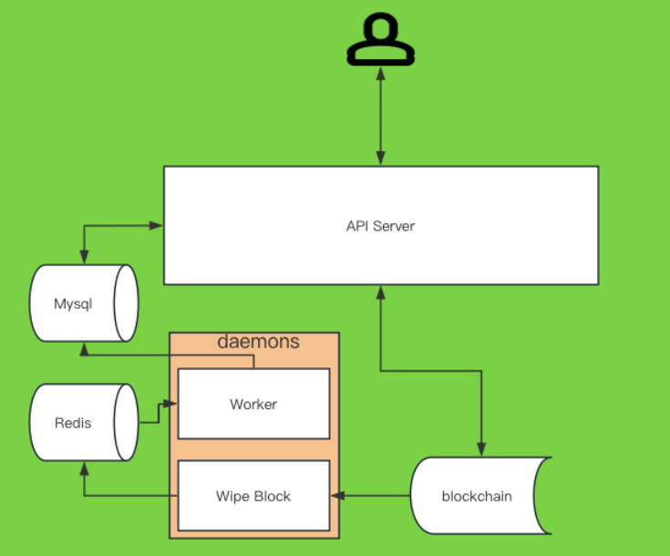

# Evolution Land Backend

<p align="center">
  <a href="https://portal.evolution.land/">
    
  </a>
  <p align="center">
    <a href="https://portal.evolution.land/">Evolution Land</a> backend service provides game data such as land plots, apostles, NFT assets, etc.
    <br />
    <a href="https://github.com/evolutionlandorg/evolutionland"><strong>Explore Evolution Land Documentation »</strong></a>
    <br />
    <a href="https://backend.evolution.land/swagger/index.html"><strong>Explore Evolution Land Backend API Documentation »</strong></a>
    <br />
    <br />
    <a href="https://portal.evolution.land/">View Evolution Land Game</a>
    ·
    <a href="https://github.com/orgs/evolutionlandorg/discussions/new?category=q-a">Report Bug</a>
    ·
    <a href="https://github.com/orgs/evolutionlandorg/discussions/new?category=ideas">Suggest New Features</a>
  </p>

</p>

## Table of Contents

- [Getting Started](#getting-started)
    - [Prerequisites](#prerequisites)
    - [Installation Steps](#installation-steps)
- [File Directory Description](#file-directory-description)
- [Configuration](#configuration)
  - [Sample Configuration](#sample-configuration)
- [Architecture](#architecture)
- [Deployment](#deployment)
  - [Deploy Server](#deploy-server)
- [Copyright Statement](#copyright-statement)

### Getting Started

###### Prerequisites

1. Golang version >= 1.22
2. Mysql version >= 8.0
3. Redis version >= 7.0

###### **Installation Steps**

1. Clone the repo

```shell
git clone https://github.com/evolutionlandorg/evo-backend
```

2. Install dependencies
```shell
go mod download
```

3. Run the server
```shell
go run .
```

### File Directory Description
```
├── Dockerfile # Dockerfile for building the image, you can use it to build the image.
├── LICENSE.txt
├── README.md
├── commands # Some useful commands
├── config # Configuration files such as contract addresses on the chain, etc.
├── contract # Contract ABI files
├── daemons # Tasks that need to run in the background, such as retrieving blocks, retrieving user assets, etc.
├── data # Some configuration information about materials and equipment
├── docs # API documentation
├── go.mod
├── go.sum
├── main.go
├── middlewares # Gin middleware
├── models # Data models
├── pkg # Third-party libraries
├── routes # API routes
├── services # Business logic
└── util # Utility classes

```

### Configuration
**All configurations are configured through environment variables**

| Configuration Name      | Default Value                                    | Description                      |
|-------------------------|--------------------------------------------------|---------------------------------|
| MYSQL_HOST              | 127.0.0.1                                        | mysql host                      |
| MYSQL_PORT              | 3306                                             | mysql port                      |
| MYSQL_DB                | consensus-backend                                | mysql database name             |
| MYSQL_USER              | root                                             | mysql username                  |
| MYSQL_PASSWORD          | 123456                                           | mysql password                  |
| REDIS_HOST              | 127.0.0.1                                        | redis host                      |
| REDIS_PORT              | 6379                                             | redis port                      |
| REDIS_PASSWORD          |                                                  | redis password                  |
| REDIS_DATABASE          | 0                                                | redis database                  |
| SSL                     | true                                             | Whether to use SSL for ETH rpc  |
| GIN_MODE                |                                                  | gin running mode                |
| EVO_ENV                 | production                                       | Environment variable, production means production environment, dev means development environment |
| WEB_HOST                | https://portal.evolution.land                    | web host                        |
| APOSTLE_PICTURE_SERVER             | http://apostle-svg                               | apostle svg host                |
| HECO_RPC                | https://http-testnet.hecochain.com               | heco rpc host                   |
| HECO_WSS_RPC            | wss://ws-testnet.hecochain.com                   | eth rpc host                    |
| POLYGON_RPC             | https://polygon-mumbai.api.onfinality.io/public  | polygon rpc host                |
| POLYGON_WSS_RPC         | https://polygon-mumbai.api.onfinality.io/public	 | polygon wss rpc host            |
| ETH_RPC                 |                                                  | eth rpc host                    |
| ETH_WSS_RPC             |                                                  | eth wss rpc host                |
| CRAB_NODE               | https://crab-rpc.darwinia.network                | crab rpc host                   |
| CRAB_WSS_RPC            | wss://crab-rpc.darwinia.network                  | crab wss rpc host               |
| LOG_LEVEL               | DEBUG                                            | Log level                       |
| DATABASE_SHOW_LOG_DEBUG | false                                            | Show database log or not        |
| TRON-PRO-API-KEY        |                                                  |                                 |

#### Sample Configuration
```shell
MYSQL_HOST=127.0.0.1
MYSQL_PORT=3306
MYSQL_DB=consensus-backend
MYSQL_USER=root
MYSQL_PASSWORD=123456

REDIS_HOST=127.0.0.1
REDIS_PORT=6379
REDIS_PASSWORD=
REDIS_DATABASE=0

WEB_HOST=https://evolutionland-dev.vercel.app
API_SERVER_HOST=http://apostle-svg # https://github.com/evolutionlandorg/apostle-svg project service address

ETH_RPC= # eth testnet has been deprecated
ETH_WSS_RPC= # eth testnet has been deprecated

HECO_RPC=https://http-testnet.hecochain.com
HECO_WSS_RPC=wss://ws-testnet.hecochain.com

POLYGON_RPC=https://polygon-mumbai.api.onfinality.io/public
POLYGON_WSS_RPC=https://polygon-mumbai.api.onfinality.io/public

CRAB_NODE=https://crab-rpc.darwinia.network
CRAB_WSS_RPC=wss://crab-rpc.darwinia.network

LOG_LEVEL=DEBUG
DATABASE_SHOW_LOG_DEBUG=true

TRON-PRO-API-KEY=

EVO_ENV=dev 
```

### Architecture


### Deployment
#### Deploy Server
1. Pull the latest code: `git clone https://github.com/evolutionlandorg/evo-backend`
2. Build the image: `docker build -t evo-backend:latest .`
3. Run the image: `docker run -d -p 8080:8080 --restart=always --name evo-backend evo-backend:latest`

#### Deploy all Evolution Land server components
**See [evolution land docs](https://github.com/evolutionlandorg/evolutionland)**

### Copyright Statement

This project is licensed under the terms of the MIT license, see [LICENSE.txt](https://github.com/evolutionlandorg/evo-backend/blob/master/LICENSE.txt)

